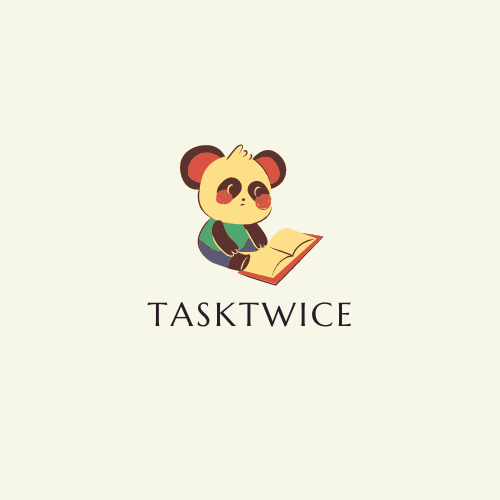

# FECAP - Fundação de Comércio Álvares Penteado

<p align="center">
<a href= "https://www.fecap.br/"></a>
</p>

# Palavreando 📚

## TaskTwice

## Integrantes: <a href="https://www.linkedin.com/in/eduardo-fraga-santos/">Eduardo Fraga</a>, <a href="https://www.linkedin.com/in/gabriel-berto-167475141/">Gabriel Berto</a>, <a href="https://www.linkedin.com/in/nicolle-costa-a85100211/">Nicolle Costa</a>, <a href="https://www.linkedin.com/in/rebeca-da-silva-vieira-850a83242/">Rebeca Vieira</a>

## Professores Orientadores: <a href="https://www.linkedin.com/in/victorbarq/">Victor Rosetti</a>, <a href="https://www.linkedin.com/in/adriano-valente-534576135/">Adriano Valente</a>

## <p align="center" > Descrição

<p align="center">

</p>


O projeto "Palavreando" em parceria com a ONG "Ninho de vó" tem como objetivo despertar a curiosidade, incentivar a autonomia e preparar crianças para os diversos desafios da vida.
<br><br>
Através de uma metodologia inteligente, impulsionamos os pequenos estudantes a conquistarem seus sonhos desde o primeiro passo.
<br><br>

## 🛠 Estrutura de pastas

-Raiz<br>
|<br>
|-->documentos<br>
  &emsp;|-->antigos<br>
  &emsp;|Documentação.docx<br>
|-->executáveis<br>
  &emsp;|-->windows<br>
  &emsp;|-->android<br>
  &emsp;|-->HTML<br>
|-->imagens<br>
|-->src<br>
  &emsp;|-->Backend<br>
  &emsp;|-->Frontend<br>
|readme.md<br>


Há também 4 pastas que seguem da seguinte forma:

<b>documentos</b>: Toda a documentação estará nesta pasta.

<b>executáveis</b>: Binários e executáveis do projeto devem estar nesta pasta.

<b>imagens</b>: Imagens do sistema

<b>src</b>: Pasta que contém o código fonte.

## 🛠 Instalação

<b>Android:</b>

Faça o Download do JOGO.apk no seu celular.
Execute o APK e siga as instruções de seu telefone.

```sh
Coloque código do prompt de comando se for necessário
```

## 🗃 Histórico de lançamentos

A cada atualização os detalhes devem ser lançados aqui.

* 0.0.1 - 06/03/2024
    * ENTREGA: Formulário de extensão pronto.
    * ANDAMENTO: Planejamento de conteúdo do jogo.
* 0.0.2 - 13/03/2024
    * ADD: Conteúdo do jogo definido.
    * ADD: Instituição escolhida.
* 0.1.1 - 31/03/2024
    * ANDAMENTO: Telas iniciadas.
* 0.1.2 - 11/04/2024
    * ANDAMENTO: Banco de dados iniciado.
    * ANDAMENTO: Telas.
* 0.2.1 - 23/04/2024
    * ENTREGA: Banco de dados finalizado.

## 📋 Licença/License


## 🎓 Referências
Aqui estão as referências usadas no projeto.

1. https://github.com/iuricode/readme-template](https://www.udemy.com/course/desenvolvimento-de-jogos-com-android-studio-e-java/learn/lecture/34589370?start=1065#overview)
2. https://www.udemy.com/share/1013us3@NeOpK3_HgZqXha6ZqZoMN9titPehNBWbnn5n0Xlr3IEf9lfcbagsn4SCdh1bvr-G/

